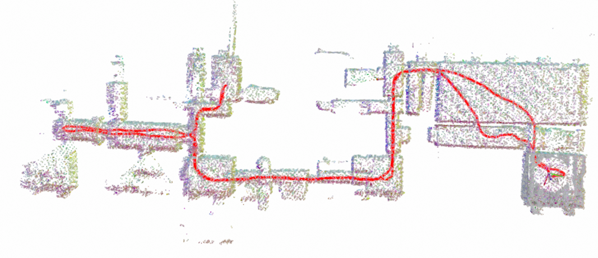
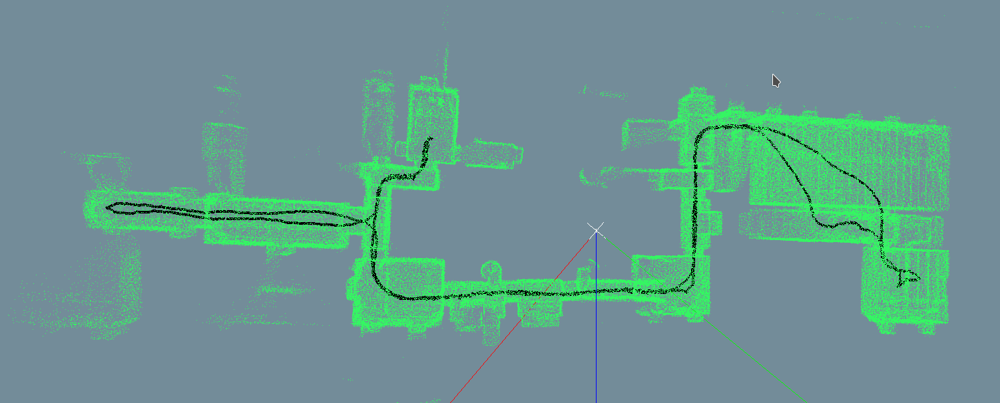
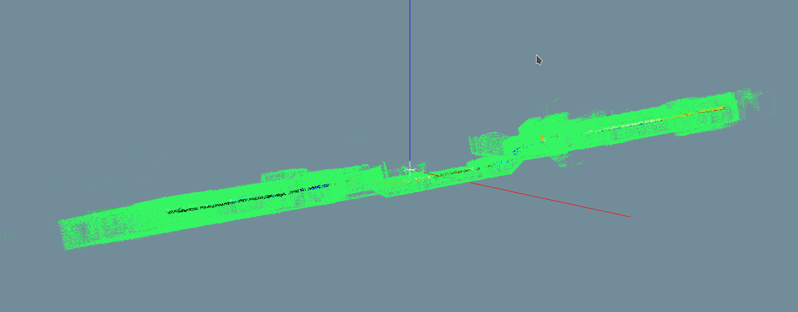

# PIN-SLAM to HDMapping simplified instruction

**Note:** PIN-SLAM is a neural (implicit map) SLAM running on PyTorch/CUDA — an
**NVIDIA GPU** and the
[NVIDIA Container Toolkit](https://docs.nvidia.com/datacenter/cloud-native/container-toolkit/latest/install-guide.html)
are required. It processes the bag offline (about 30 min for this dataset on a
laptop RTX 2060), watching the map grow in its own 3D viewer instead of RViz.

## Step 1 (prepare data)
Download the dataset `reg-1.bag` by clicking [link](https://cloud.cylab.be/public.php/dav/files/7PgyjbM2CBcakN5/reg-1.bag) (it is part of [Bunker DVI Dataset](https://charleshamesse.github.io/bunker-dvi-dataset)) and convert with [tool](https://github.com/MapsHD/livox_bag_aggregate) to `reg-1.bag-pc.bag`.

File `reg-1.bag-pc.bag` is an input for further calculations.
It should be located in `~/hdmapping-benchmark/data`.

## Step 2 (prepare docker)
```shell
mkdir -p ~/hdmapping-benchmark
cd ~/hdmapping-benchmark
git clone https://github.com/MapsHD/benchmark-PIN-SLAM-to-HDMapping.git --recursive
cd benchmark-PIN-SLAM-to-HDMapping
git checkout Bunker-DVI-Dataset-reg-1
docker build -t pin-slam_cuda .
```

## Step 3 (run docker, file `reg-1.bag-pc.bag` should be in `~/hdmapping-benchmark/data`)
```shell
cd ~/hdmapping-benchmark/benchmark-PIN-SLAM-to-HDMapping
chmod +x docker_session_run-pin-slam.sh
cd ~/hdmapping-benchmark/data
~/hdmapping-benchmark/benchmark-PIN-SLAM-to-HDMapping/docker_session_run-pin-slam.sh reg-1.bag-pc.bag .
```

While the bag is processed you can watch PIN-SLAM build the neural map live in
its 3D viewer (the viewer closes automatically ~30 s after the run finishes,
then the HDMapping session is generated):



## Step 4 (Open and visualize data)
Expected data should appear in `~/hdmapping-benchmark/data/output_hdmapping-PIN-SLAM`.
Use tool [multi_view_tls_registration_step_2](https://github.com/MapsHD/HDMapping) to open `session.json` from `~/hdmapping-benchmark/data/output_hdmapping-PIN-SLAM`.





You should see the following data in folder `~/hdmapping-benchmark/data/output_hdmapping-PIN-SLAM`:

lio_initial_poses.reg

poses.reg

scan_lio_*.laz

session.json

trajectory_lio_*.csv

poses_tum_abs.txt (trajectory in TUM format with sensor timestamps — ready for evo)

odom_poses_tum.txt / slam_poses_tum.txt (raw PIN-SLAM trajectories, relative timestamps)

## Contact email
januszbedkowski@gmail.com
